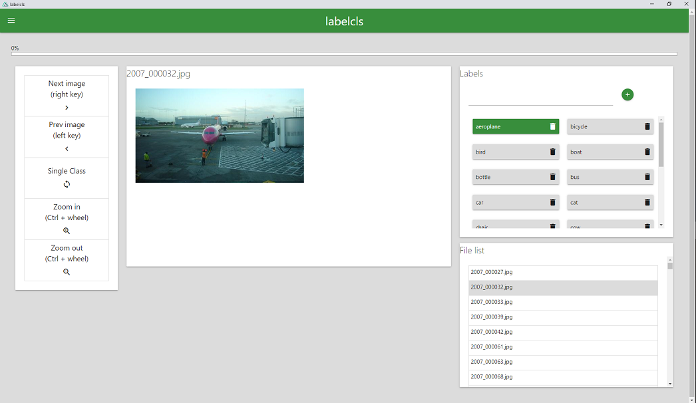

## labelcls
Image classification annotation tool.


<br><br><br>


## Setup
```
pip install -r requirements.txt
```

## Run
```
python run.py
```

## Build
```
python -m eel labelcls/run.py labelcls/view --onefile --noconsole
```

## Build for pypi
```
python setup.py sdist bdist_wheel
# check
twine check dist/*
# test upload
twine upload --repository testpypi dist/*
# upload
twine upload dist/*
```